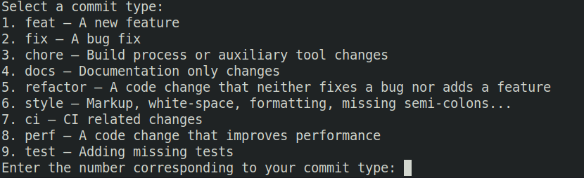

## Commit Helper


"Commit Helper" is a command-line tool designed to simplify and standardize the process of crafting meaningful Git commit messages. With predefined commit types and a structured input format, developers can efficiently create informative commit messages. This tool enhances codebase clarity and collaboration, making it an essential asset for streamlined version control workflows.


## Installing the command line tool

Clone the git repo by git clone command

```sh
git@github.com:birbirbrian/CommitHelper.git
```

Put the script under the `/usr/local/bin`

## Using the command line tool

Simply use `ch` instead of `git commit` when committing.
Make sure you already add all the commited files.

```sh
ch
```

## Sample usage

